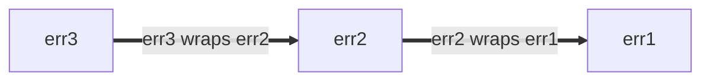

<!-- Generated by scripts/sync-references.sh. Do not edit. -->
# Go Style Best Practices (2 of 6)

Source: https://google.github.io/styleguide/go/best-practices (upstream 1809c76, synced 2026-08-11)

Sections in this chunk: Error structure, Adding information to errors, Placement of %w in errors, Logging errors, Program initialization, Program checks and panics, When to panic, Documentation

---

### Error structure

If callers need to interrogate the error (e.g., distinguish different error
conditions), give the error value structure so that this can be done
programmatically rather than having the caller perform string matching. This
advice applies to production code as well as to tests that care about different
error conditions.

The simplest structured errors are unparameterized global values.

```go
type Animal string

var (
    // ErrDuplicate occurs if this animal has already been seen.
    ErrDuplicate = errors.New("duplicate")

    // ErrMarsupial occurs because we're allergic to marsupials outside Australia.
    // Sorry.
    ErrMarsupial = errors.New("marsupials are not supported")
)

func process(animal Animal) error {
    switch {
    case seen[animal]:
        return ErrDuplicate
    case marsupial(animal):
        return ErrMarsupial
    }
    seen[animal] = true
    // ...
    return nil
}
```

The caller can simply compare the returned error value of the function with one
of the known error values:

```go
// Good:
func handlePet(...) {
    switch err := process(an); err {
    case ErrDuplicate:
        return fmt.Errorf("feed %q: %v", an, err)
    case ErrMarsupial:
        // Try to recover with a friend instead.
        alternate = an.BackupAnimal()
        return handlePet(..., alternate, ...)
    }
}
```

The above uses sentinel values, where the error must be equal (in the sense of
`==`) to the expected value. That is perfectly adequate in many cases. If
`process` returns wrapped errors (discussed below), you can use [`errors.Is`].

```go
// Good:
func handlePet(...) {
    switch err := process(an); {
    case errors.Is(err, ErrDuplicate):
        return fmt.Errorf("feed %q: %v", an, err)
    case errors.Is(err, ErrMarsupial):
        // ...
    }
}
```

Do not attempt to distinguish errors based on their string form. (See
[Go Tip #13: Designing Errors for Checking](https://google.github.io/styleguide/go/index.html#gotip)
for more.)

```go
// Bad:
func handlePet(...) {
    err := process(an)
    if regexp.MatchString(`duplicate`, err.Error()) {...}
    if regexp.MatchString(`marsupial`, err.Error()) {...}
}
```

If there is extra information in the error that the caller needs
programmatically, it should ideally be presented structurally. For example, the
[`os.PathError`] type is documented to place the pathname of the failing
operation in a struct field which the caller can easily access.

Other error structures can be used as appropriate, for example a project struct
containing an error code and detail string. [Package `status`][status] is a
common encapsulation; if you choose this approach (which you are not obligated
to do), use [canonical codes]. See
[Go Tip #89: When to Use Canonical Status Codes as Errors](https://google.github.io/styleguide/go/index.html#gotip)
to know if using status codes is the right choice.

[`os.PathError`]: https://pkg.go.dev/os#PathError
[`errors.Is`]: https://pkg.go.dev/errors#Is
[`errors.As`]: https://pkg.go.dev/errors#As
[`package cmp`]: https://pkg.go.dev/github.com/google/go-cmp/cmp
[status]: https://pkg.go.dev/google.golang.org/grpc/status
[canonical codes]: https://pkg.go.dev/google.golang.org/grpc/codes

<a id="error-extra-info"></a>

### Adding information to errors

When adding information to errors, avoid redundant information that the
underlying error already provides. The `os` package, for instance, already
includes path information in its errors.

```go
// Good:
if err := os.Open("settings.txt"); err != nil {
  return fmt.Errorf("launch codes unavailable: %v", err)
}

// Output:
//
// launch codes unavailable: open settings.txt: no such file or directory
```

Here, "launch codes unavailable" adds specific meaning to the `os.Open` error
that's relevant to the current function's context, without duplicating the
underlying file path information.

```go
// Bad:
if err := os.Open("settings.txt"); err != nil {
  return fmt.Errorf("could not open settings.txt: %v", err)
}

// Output:
//
// could not open settings.txt: open settings.txt: no such file or directory
```

Don't add an annotation if its sole purpose is to indicate a failure without
adding new information. The presence of an error sufficiently conveys the
failure to the caller.

```go
// Bad:
return fmt.Errorf("failed: %v", err) // just return err instead
```

The
[choice between `%v` and `%w` when wrapping errors](https://go.dev/blog/go1.13-errors#whether-to-wrap)
with `fmt.Errorf` is a nuanced decision that significantly impacts how errors
are propagated handled, inspected, and documented within your application. The
core principle is to make error values useful to their observers, whether those
observers are humans or code.

1.  **`%v` for simple annotation or new error**

    The `%v` verb is your general-purpose tool for string formatting of any Go
    value, including errors. When used with `fmt.Errorf`, it embeds the string
    representation of an error (what its `Error()` method returns) into a new
    error value, dropping any structured information from the original error.
    Examples to use `%v`:

    *   Adding interesting, non-redundant context: as in the example above.

    *   Logging or displaying errors: When the primary goal is to present a
        human-readable error message in logs or to a user, and you don't intend
        for the caller to programmatically `errors.Is` or `errors.As` the error
        (Note: `errors.Unwrap` is generally not recommended here as it doesn't
        handle multi-errors).

    *   Creating fresh, independent errors: Sometimes it is necessary to
        transform an error into a new error message, thereby hiding the
        specifics of the original error. This practice is particularly
        beneficial at system boundaries, including but not limited to RPC, IPC,
        and storage, where we translate domain-specific errors into a canonical
        error space.

        ```go
        // Good:
        func (*FortuneTeller) SuggestFortune(context.Context, *pb.SuggestionRequest) (*pb.SuggestionResponse, error) {
          // ...
          if err != nil {
            return nil, fmt.Errorf("couldn't find fortune database: %v", err)
          }
        }
        ```

        We could also explicitly annotate RPC code `Internal` to the example
        above.

        ```go
        // Good:
        import (
          "google.golang.org/grpc/codes"
          "google.golang.org/grpc/status"
        )

        func (*FortuneTeller) SuggestFortune(context.Context, *pb.SuggestionRequest) (*pb.SuggestionResponse, error) {
          // ...
          if err != nil {
            // Or use fmt.Errorf with the %w verb if deliberately wrapping an
            // error which the caller is meant to unwrap.
            return nil, status.Errorf(codes.Internal, "couldn't find fortune database", status.ErrInternal)
          }
        }
        ```

1.  **`%w` (wrap) for programmatic inspection and error chaining**

    The `%w` verb is specifically designed for error wrapping. It creates a new
    error that provides an `Unwrap()` method, allowing callers to
    programmatically inspect the error chain using `errors.Is` and `errors.As`.
    Examples to use `%w`:

    *   Adding context while preserving the original error for programmatic
        inspection: This is the primary use case within helpers of your
        application. You want to enrich an error with additional context (e.g.,
        what operation was being performed when it failed) but still allow the
        caller to check if the underlying error is a specific sentinel error or
        type.

        ```go
        // Good:
        func (s *Server) internalFunction(ctx context.Context) error {
          // ...
          if err != nil {
            return fmt.Errorf("couldn't find remote file: %w", err)
          }
        }
        ```

        This allows a higher-level function to do `errors.Is(err,
        fs.ErrNotExist)` if the underlying error was `fs.ErrNotExist`, even
        though it's wrapped.

        At points where your system interacts with external systems like RPC,
        IPC, or storage, it's often better to translate domain-specific errors
        into a standardized error space (e.g., gRPC status codes) rather than
        simply wrapping the raw underlying error with `%w`. The client typically
        doesn't care about the exact internal file system error; they care about
        the canonical result (e.g., `Internal`, `NotFound`, `PermissionDenied`).

    *   When you explicitly document and test the underlying errors you expose:
        If your package's API guarantees that certain underlying errors can be
        unwrapped and checked by callers (e.g., "this function might return
        `ErrInvalidConfig` wrapped within a more general error"), then `%w` is
        appropriate. This forms part of your package's contract.

See also:

*   [Error Documentation Conventions](#documentation-conventions-errors)
*   [Blog post on error wrapping](https://blog.golang.org/go1.13-errors)

<a id="error-percent-w"></a>

### Placement of %w in errors

Prefer to place `%w` at the end of an error string *if* you are to use
[error wrapping](https://go.dev/blog/go1.13-errors) with the `%w` formatting
verb.

Errors can be wrapped with the `%w` verb, or by placing them in a
[structured error](https://google.github.io/styleguide/go/index.html#gotip) that
implements `Unwrap() error` (ex:
[`fs.PathError`](https://pkg.go.dev/io/fs#PathError)).

Wrapped errors form error chains: each new layer of wrapping adds a new entry to
the front of the error chain. The error chain can be traversed with the
`Unwrap() error` method. For example:

```go
err1 := fmt.Errorf("err1")
err2 := fmt.Errorf("err2: %w", err1)
err3 := fmt.Errorf("err3: %w", err2)
```

This forms an error chain of the form,



Regardless of where the `%w` verb is placed, the error returned always
represents the front of the error chain, and the `%w` is the next child.
Similarly, `Unwrap() error` always traverses the error chain from newest to
oldest error.

Placement of the `%w` verb does, however, affect whether the error chain is
printed newest to oldest, oldest to newest, or neither:

```go
// Good:
err1 := fmt.Errorf("err1")
err2 := fmt.Errorf("err2: %w", err1)
err3 := fmt.Errorf("err3: %w", err2)
fmt.Println(err3) // err3: err2: err1
// err3 is a newest-to-oldest error chain, that prints newest-to-oldest.
```

```go
// Bad:
err1 := fmt.Errorf("err1")
err2 := fmt.Errorf("%w: err2", err1)
err3 := fmt.Errorf("%w: err3", err2)
fmt.Println(err3) // err1: err2: err3
// err3 is a newest-to-oldest error chain, that prints oldest-to-newest.
```

```go
// Bad:
err1 := fmt.Errorf("err1")
err2 := fmt.Errorf("err2-1 %w err2-2", err1)
err3 := fmt.Errorf("err3-1 %w err3-2", err2)
fmt.Println(err3) // err3-1 err2-1 err1 err2-2 err3-2
// err3 is a newest-to-oldest error chain, that neither prints newest-to-oldest
// nor oldest-to-newest.
```

Therefore, in order for error text to mirror error chain structure, prefer
placing the `%w` verb at the end with the form `[...]: %w`.

<a id="error-percent-w-sentinel-placement"></a>

#### Sentinel error placement

An exception to this rule is when wrapping sentinel errors. A sentinel error is
an error that serves as a primary categorization of a failure. This helps
observers quickly understand the nature of a failure (such as "not found" or
"invalid argument") without having to parse the entire error message.
Identifying that error type as early as possible in the error string is
beneficial.

Examples of sentinel errors include os errors (e.g., [`os.ErrInvalid`]) and
package-level errors.

In these cases, placing the `%w` verb at the beginning of the error string can
improve readability by immediately identifying the category of the error.

```go
// Good:
package parser

var ErrParse = fmt.Errorf("parse error")

// This is another package error that could be returned.
var ErrParseInvalidHeader = fmt.Errorf("%w: invalid header", ErrParse)

func parseHeader() error {
  err := checkHeader()
  return fmt.Errorf("%w: invalid character in header: %v", ErrParseInvalidHeader, err)
}

err := fmt.Errorf("%w: couldn't find fortune database: %v", ErrInternal, err)
```

Placing the status at the beginning ensures that the most relevant categorical
information is most prominent.

```go
// Bad:
package parser

var ErrParse = fmt.Errorf("parse error")

// This is another package error that could be returned.
var ErrParseInvalidHeader = fmt.Errorf("%w: invalid header", ErrParse)

func parseHeader() error {
  err := checkHeader()
  return fmt.Errorf("invalid character in header: %v: %w", err, ErrParseInvalidHeader)
}

var ErrInternal = status.Error(codes.Internal, "internal")
err2 := fmt.Errorf("couldn't find fortune database: %v: %w", err, ErrInternal)
```

When you place it at the end, it makes it harder to identify the error category
when reading the error text, as it's buried in the specific error details.

[`os.ErrInvalid`]: https://pkg.go.dev/os#ErrInvalid

See also:

*   [Go Tip #48: Error Sentinel Values]
*   [Go Tip #106: Error Naming Conventions]

[commentary]: decisions#commentary
[Go Tip #48: Error Sentinel Values]: https://google.github.io/styleguide/go/index.html#gotip
[Go Tip #106: Error Naming Conventions]: https://google.github.io/styleguide/go/index.html#gotip

<a id="error-logging"></a>

### Logging errors

Functions sometimes need to tell an external system about an error without
propagating it to their callers. Logging is an obvious choice here; but be
conscious of what and how you log errors.

*   Like [good test failure messages], log messages should clearly express what
    went wrong and help the maintainer by including relevant information to
    diagnose the problem.

*   Avoid duplication. If you return an error, it's usually better not to log it
    yourself but rather let the caller handle it. The caller can choose to log
    the error, or perhaps rate-limit logging using [`rate.Sometimes`]. Other
    options include attempting recovery or even [stopping the program]. In any
    case, giving the caller control helps avoid logspam.

    The downside to this approach, however, is that any logging is written using
    the caller's line coordinates.

*   Be careful with [PII]. Many log sinks are not appropriate destinations for
    sensitive end-user information.

*   Use `log.Error` sparingly. ERROR level logging causes a flush and is more
    expensive than lower logging levels. This can have serious performance
    impact on your code. When deciding between error and warning levels,
    consider the best practice that messages at the error level should be
    actionable rather than "more serious" than a warning.

*   Inside Google, we have monitoring systems that can be set up for more
    effective alerting than writing to a log file and hoping someone notices it.
    This is similar but not identical to the standard library
    [package `expvar`].

[good test failure messages]: https://google.github.io/styleguide/go/decisions#useful-test-failures
[stopping the program]: #checks-and-panics
[`rate.Sometimes`]: https://pkg.go.dev/golang.org/x/time/rate#Sometimes
[PII]: https://en.wikipedia.org/wiki/Personal_data
[package `expvar`]: https://pkg.go.dev/expvar

<a id="vlog"></a>

#### Custom verbosity levels

Use verbose logging ([`log.V`]) to your advantage. Verbose logging can be useful
for development and tracing. Establishing a convention around verbosity levels
can be helpful. For example:

*   Write a small amount of extra information at `V(1)`
*   Trace more information in `V(2)`
*   Dump large internal states in `V(3)`

To minimize the cost of verbose logging, you should ensure not to accidentally
call expensive functions even when `log.V` is turned off. `log.V` offers two
APIs. The more convenient one carries the risk of this accidental expense. When
in doubt, use the slightly more verbose style.

```go
// Good:
for _, sql := range queries {
  log.V(1).Infof("Handling %v", sql)
  if log.V(2) {
    log.Infof("Handling %v", sql.Explain())
  }
  sql.Run(...)
}
```

```go
// Bad:
// sql.Explain called even when this log is not printed.
log.V(2).Infof("Handling %v", sql.Explain())
```

[`log.V`]: https://pkg.go.dev/github.com/golang/glog#V

<a id="program-init"></a>

### Program initialization

Program initialization errors (such as bad flags and configuration) should be
propagated upward to `main`, which should call `log.Exit` with an error that
explains how to fix the error. In these cases, `log.Fatal` should not generally
be used, because a stack trace that points at the check is not likely to be as
useful as a human-generated, actionable message.

<a id="checks-and-panics"></a>

### Program checks and panics

As stated in the [decision against panics], standard error handling should be
structured around error return values. Libraries should prefer returning an
error to the caller rather than aborting the program, especially for transient
errors.

It is occasionally necessary to perform consistency checks on an invariant and
terminate the program if it is violated. In general, this is only done when a
failure of the invariant check means that the internal state has become
unrecoverable. The most reliable way to do this in the Google codebase is to
call `log.Fatal`. Using `panic` in these cases is not reliable, because it is
possible for deferred functions to deadlock or further corrupt internal or
external state.

Similarly, resist the temptation to recover panics to avoid crashes, as doing so
can result in propagating a corrupted state. The further you are from the panic,
the less you know about the state of the program, which could be holding locks
or other resources. The program can then develop other unexpected failure modes
that can make the problem even more difficult to diagnose. Instead of trying to
handle unexpected panics in code, use monitoring tools to surface unexpected
failures and fix related bugs with a high priority.

**Note:** The standard [`net/http` server] violates this advice and recovers
panics from request handlers. Consensus among experienced Go engineers is that
this was a historical mistake. If you sample server logs from application
servers in other languages, it is common to find large stacktraces that are left
unhandled. Avoid this pitfall in your servers.

[decision against panics]: https://google.github.io/styleguide/go/decisions#dont-panic
[`net/http` server]: https://pkg.go.dev/net/http#Server

<a id="when-to-panic"></a>

### When to panic

The standard library panics on API misuse. For example, [`reflect`] issues a
panic in many cases where a value is accessed in a way that suggests it was
misinterpreted. This is analogous to the panics on core language bugs such as
accessing an element of a slice that is out of bounds. Code review and tests
should discover such bugs, which are not expected to appear in production code.
These panics act as invariant checks that do not depend on a library, as the
standard library does not have access to the [levelled `log`] package that the
Google codebase uses.

[`reflect`]: https://pkg.go.dev/reflect
[levelled `log`]: decisions#logging

Another case in which panics can be useful, though uncommon, is as an internal
implementation detail of a package which always has a matching recover in the
callchain. Parsers and similar deeply nested, tightly coupled internal function
groups can benefit from this design, where plumbing error returns adds
complexity without value.

The key attribute of this design is that these **panics are never allowed to
escape across package boundaries** and do not form part of the package's API.
This is typically accomplished with a top-level deferred function that uses
`recover` to translate a propagated panic into a returned error at the public
API boundary. It requires the code that panics and recovers to distinguish
between panics that the code raises itself and those that it doesn't:

```go
// Good:
type syntaxError struct {
  msg string
}

func parseInt(in string) int {
  n, err := strconv.Atoi(in)
  if err != nil {
    panic(&syntaxError{"not a valid integer"})
  }
}

func Parse(in string) (_ *Node, err error) {
  defer func() {
    if p := recover(); p != nil {
      sErr, ok := p.(*syntaxError)
      if !ok {
        panic(p) // Propagate the panic since it is outside our code's domain.
      }
      err = fmt.Errorf("syntax error: %v", sErr.msg)
    }
  }()
  ... // Parse input calling parseInt internally to parse integers
}
```

> **Warning:** Code employing this pattern must take care to manage any
> resources associated with the code run in such defer-managed sections (e.g.,
> close, free, or unlock).
>
> See: [Go Tip #81: Avoiding Resource Leaks in API Design]

Panic is also used when the compiler cannot identify unreachable code, for
example when using a function like `log.Fatal` that will not return:

```go
// Good:
func answer(i int) string {
    switch i {
    case 42:
        return "yup"
    case 54:
        return "base 13, huh"
    default:
        log.Fatalf("Sorry, %d is not the answer.", i)
        panic("unreachable")
    }
}
```

[Do not call `log` functions before flags have been parsed.](https://pkg.go.dev/github.com/golang/glog#pkg-overview)
If you must die in a package initialization function (an `init` or a
["must" function](decisions#must-functions)), a panic is acceptable in place of
the fatal logging call.

See also:

*   [Handling panics](https://go.dev/ref/spec#Handling_panics) and
    [Run-time Panics](https://go.dev/ref/spec#Run_time_panics) in the language
    specification
*   [Defer, Panic, and Recover](https://go.dev/blog/defer-panic-and-recover)
*   [On the uses and misuses of panics in Go](https://eli.thegreenplace.net/2018/on-the-uses-and-misuses-of-panics-in-go/)

[Go Tip #81: Avoiding Resource Leaks in API Design]: https://google.github.io/styleguide/go/index.html#gotip

<a id="documentation"></a>

## Documentation

<a id="documentation-conventions"></a>
